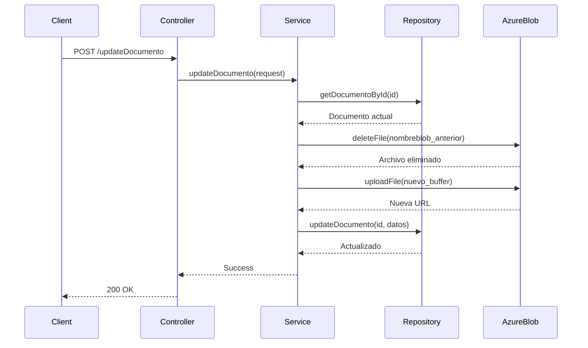
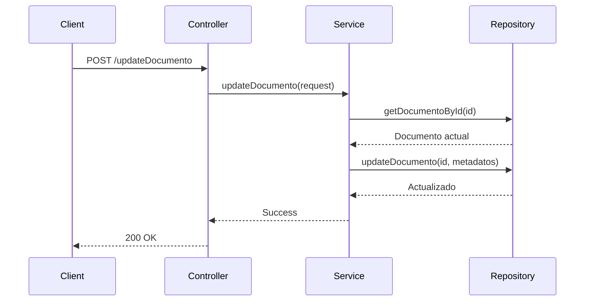

# Microservicio de Actualización de Documentos en Azure Blob Storage

Este microservicio permite actualizar documentos existentes en Azure Blob Storage, ofreciendo flexibilidad para actualizar tanto el archivo físico como los metadatos del documento.

## Características

### 1. Actualización Flexible
- **Solo archivo**: Reemplaza el archivo en Azure manteniendo los metadatos
- **Solo metadatos**: Actualiza información de validación, estatus, etc.
- **Completa**: Actualiza archivo y metadatos simultáneamente

### 2. Gestión Automática en Azure
- Elimina automáticamente el archivo anterior de Azure
- Sube el nuevo archivo con un nombre único
- Actualiza las referencias en la base de datos
- Mantiene la integridad de los datos

### 3. Seguimiento de Validación
- Registra quién validó el documento
- Fecha automática de validación
- Comentarios de validación
- Estados personalizables

## Endpoint

**POST** `/api/documentos/updateDocumento`

## Casos de Uso

### Caso 1: Actualizar solo el archivo

Usuario necesita reemplazar un documento con una versión más reciente del mismo archivo.

```json
{
  "id": 1,
  "archivoBase64": "JVBERi0xLjQKJeLjz9MKMy4uLg==",
  "formato": "pdf",
  "nombreoriginal": "licencia_actualizada.pdf",
  "tamanio": 204800
}
```

**Proceso:**
1. Se elimina el archivo anterior de Azure Blob Storage
2. Se sube el nuevo archivo con nombre único
3. Se actualizan las columnas: `urlarchivo`, `nombreblob`, `formato`, `nombreoriginal`, `tamanio`

### Caso 2: Actualizar solo metadatos

Administrador valida un documento sin modificar el archivo.

```json
{
  "id": 1,
  "validacion": "aprobado",
  "validacioncomentarios": "Documento verificado correctamente",
  "validacionusuario": 2,
  "idestatus": 2
}
```

**Proceso:**
1. Se actualizan solo los campos de metadatos
2. Se registra automáticamente la fecha de validación
3. El archivo en Azure permanece sin cambios

### Caso 3: Actualización completa

Usuario reemplaza el archivo y el administrador lo valida simultáneamente.

```json
{
  "id": 1,
  "archivoBase64": "JVBERi0xLjQKJeLjz9MKMy4uLg==",
  "formato": "pdf",
  "nombreoriginal": "licencia_actualizada.pdf",
  "tamanio": 204800,
  "validacion": "aprobado",
  "validacioncomentarios": "Documento actualizado y verificado",
  "validacionusuario": 2,
  "idestatus": 2
}
```

**Proceso:**
1. Se reemplaza el archivo en Azure
2. Se actualizan todos los metadatos
3. Se registra la validación completa

## Parámetros del Request

| Campo | Tipo | Requerido | Descripción |
|-------|------|-----------|-------------|
| `id` | number | ✅ Sí | ID del documento a actualizar |
| `archivoBase64` | string | ❌ No | Nuevo archivo codificado en base64 |
| `formato` | string | ❌ No | Formato del archivo (pdf, jpg, png, etc.) |
| `nombreoriginal` | string | ❌ No | Nombre original del archivo |
| `tamanio` | number | ❌ No | Tamaño del archivo en bytes |
| `validacion` | string | ❌ No | Estado de validación (pendiente, aprobado, rechazado) |
| `validacioncomentarios` | string | ❌ No | Comentarios del validador |
| `validacionusuario` | number | ❌ No | ID del usuario que valida |
| `idestatus` | number | ❌ No | ID del nuevo estatus |

**Nota**: Debes proporcionar al menos un campo para actualizar (además del `id`).

## Response

### Éxito (200)
```json
{
  "code": 200,
  "internalCode": "SUCCESS",
  "message": "Documento actualizado exitosamente en Azure Blob Storage y base de datos",
  "data": null
}
```

### Error (400/404/500)
```json
{
  "code": 404,
  "internalCode": "TYPE-U-documentos-update-001",
  "message": "Documento no encontrado",
  "data": null
}
```

## Códigos de Error

| Código | Descripción |
|--------|-------------|
| `TYPE-U-documentos-update-001` | Documento no encontrado |
| `TYPE-U-documentos-update-002` | Error al actualizar documento |
| `TYPE-U-documentos-007` | Error en la actualización de base de datos |

## Arquitectura del Microservicio

```
Controller (documentos-controller.ts)
    ↓
Expose (documentos-expose.ts)
    ↓
Service Front (documentos-service.ts)
    ↓
Service Tables (documentos-service.ts)
    ↓
    ├─→ Azure Blob Service (azure-blob-service.ts)
    │   ├─→ deleteFile() - Elimina archivo anterior
    │   └─→ uploadFile() - Sube nuevo archivo
    │
    └─→ Repository (documentos-repository.ts)
        └─→ updateDocumento() - Actualiza BD
```

## Flujo de Actualización

### Con Archivo Nuevo



### Solo Metadatos



## Ejemplo de Uso en Frontend

### React/Next.js

```typescript
const actualizarDocumento = async (documentoId: number, file?: File) => {
  const payload: any = { id: documentoId };

  // Si hay un archivo nuevo
  if (file) {
    const base64 = await fileToBase64(file);
    payload.archivoBase64 = base64;
    payload.formato = file.name.split('.').pop();
    payload.nombreoriginal = file.name;
    payload.tamanio = file.size;
  }

  // Agregar metadatos de validación
  payload.validacion = 'aprobado';
  payload.validacioncomentarios = 'Documento verificado';
  payload.validacionusuario = currentUserId;
  payload.idestatus = 2;

  const response = await fetch('/api/documentos/updateDocumento', {
    method: 'POST',
    headers: { 'Content-Type': 'application/json' },
    body: JSON.stringify(payload)
  });

  return response.json();
};
```

### Angular

```typescript
updateDocumento(id: number, data: UpdateDocumentoRequest): Observable<any> {
  return this.http.post(`${this.apiUrl}/documentos/updateDocumento`, data);
}

// Uso con archivo
updateWithFile(id: number, file: File) {
  const reader = new FileReader();
  
  reader.onload = () => {
    const base64 = (reader.result as string).split(',')[1];
    
    const payload = {
      id,
      archivoBase64: base64,
      formato: file.name.split('.').pop(),
      nombreoriginal: file.name,
      tamanio: file.size,
      validacion: 'actualizado',
      validacionusuario: this.currentUserId
    };
    
    this.updateDocumento(id, payload).subscribe();
  };
  
  reader.readAsDataURL(file);
}

// Uso solo metadatos
updateMetadata(id: number) {
  const payload = {
    id,
    validacion: 'aprobado',
    validacioncomentarios: 'Verificado',
    validacionusuario: this.currentUserId,
    idestatus: 2
  };
  
  this.updateDocumento(id, payload).subscribe();
}
```

### Vue.js

```javascript
async actualizarDocumento(documentoId, archivo = null) {
  const payload = { id: documentoId };

  if (archivo) {
    const base64 = await this.convertirABase64(archivo);
    Object.assign(payload, {
      archivoBase64: base64,
      formato: archivo.name.split('.').pop(),
      nombreoriginal: archivo.name,
      tamanio: archivo.size
    });
  }

  // Metadatos
  Object.assign(payload, {
    validacion: 'aprobado',
    validacioncomentarios: 'Documento verificado',
    validacionusuario: this.usuarioActual.id,
    idestatus: 2
  });

  const response = await axios.post(
    '/api/documentos/updateDocumento',
    payload
  );

  return response.data;
}
```

## Validaciones

El microservicio realiza las siguientes validaciones:

1. **Documento existe**: Verifica que el ID proporcionado existe en la BD
2. **Campos requeridos**: Al menos un campo debe ser actualizado
3. **Archivo válido**: Si se proporciona `archivoBase64`, debe ser un base64 válido
4. **Formato consistente**: Si se actualiza el archivo, `formato`, `nombreoriginal` y `tamanio` deben estar presentes
5. **Referencias válidas**: `validacionusuario` e `idestatus` deben existir en sus tablas respectivas

## Transaccionalidad

El microservicio maneja las operaciones en el siguiente orden para garantizar integridad:

1. Validar existencia del documento
2. Eliminar archivo anterior de Azure (si aplica)
3. Subir nuevo archivo a Azure (si aplica)
4. Actualizar base de datos
5. En caso de error en paso 4, el archivo viejo ya fue eliminado (considerar implementar rollback)

## Consideraciones de Seguridad

1. **Autenticación**: Implementar JWT/OAuth antes de usar en producción
2. **Autorización**: Verificar permisos del usuario para actualizar documentos
3. **Validación de archivos**: Verificar tipo MIME y tamaño máximo
4. **Auditoría**: Registrar todos los cambios en una tabla de auditoría
5. **Rate limiting**: Limitar solicitudes por usuario/IP

## Mejoras Futuras

- [ ] Sistema de rollback automático si falla la actualización en BD
- [ ] Versionado de documentos (mantener historial)
- [ ] Compresión automática de imágenes
- [ ] Conversión de formatos (ej: HEIC a JPG)
- [ ] Generación de thumbnails
- [ ] Firma digital de documentos
- [ ] OCR para extracción de texto
- [ ] Validación automática con IA

## Testing

### Con curl

```bash
# Actualizar solo metadatos
curl -X POST http://localhost:3001/api/documentos/updateDocumento \
  -H "Content-Type: application/json" \
  -d '{
    "id": 1,
    "validacion": "aprobado",
    "validacioncomentarios": "OK",
    "validacionusuario": 2,
    "idestatus": 2
  }'

# Actualizar con archivo
curl -X POST http://localhost:3001/api/documentos/updateDocumento \
  -H "Content-Type: application/json" \
  -d '{
    "id": 1,
    "archivoBase64": "'"$(base64 documento.pdf)"'",
    "formato": "pdf",
    "nombreoriginal": "documento_nuevo.pdf",
    "tamanio": 204800
  }'
```

### Con Postman

1. Crear nueva request POST
2. URL: `http://localhost:3001/api/documentos/updateDocumento`
3. Headers: `Content-Type: application/json`
4. Body (raw JSON): Ver ejemplos arriba
5. Send

## Monitoreo

Logs importantes a monitorear:

- Tiempo de respuesta del microservicio
- Tamaño de archivos subidos
- Errores de conexión con Azure
- Documentos actualizados por día/hora
- Usuarios más activos en actualizaciones

## Soporte

Para problemas o preguntas sobre este microservicio:

1. Revisar logs en la consola del servidor
2. Verificar connection string de Azure
3. Confirmar que el documento existe en BD
4. Validar formato del base64
5. Revisar permisos del contenedor en Azure
